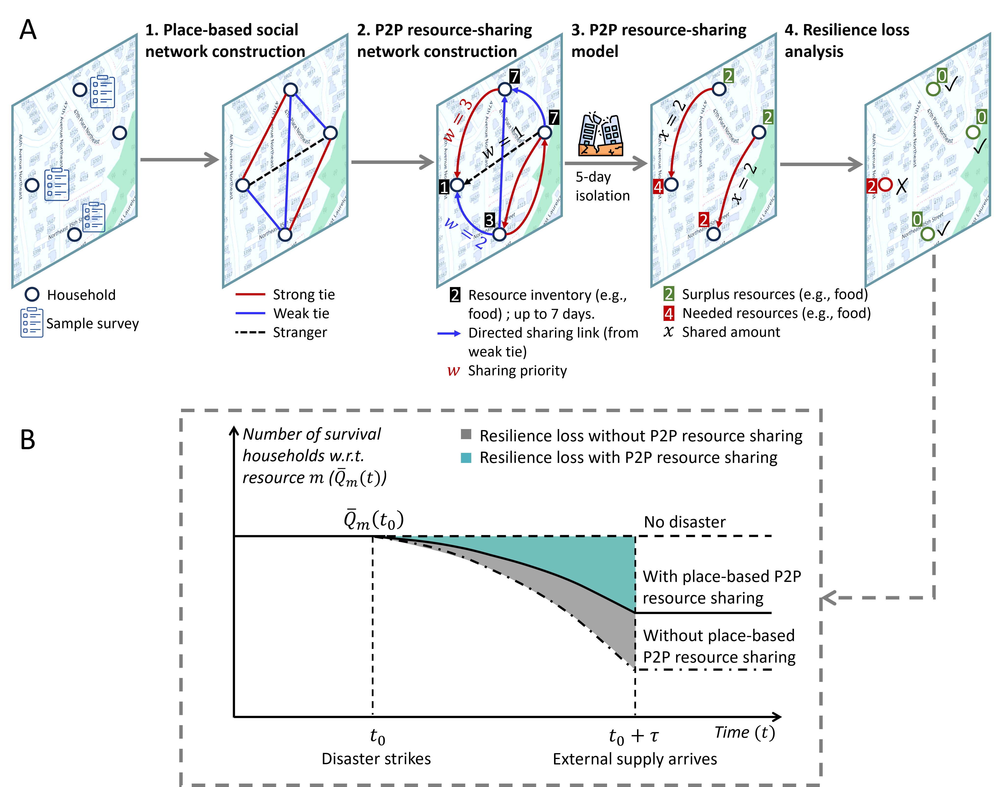
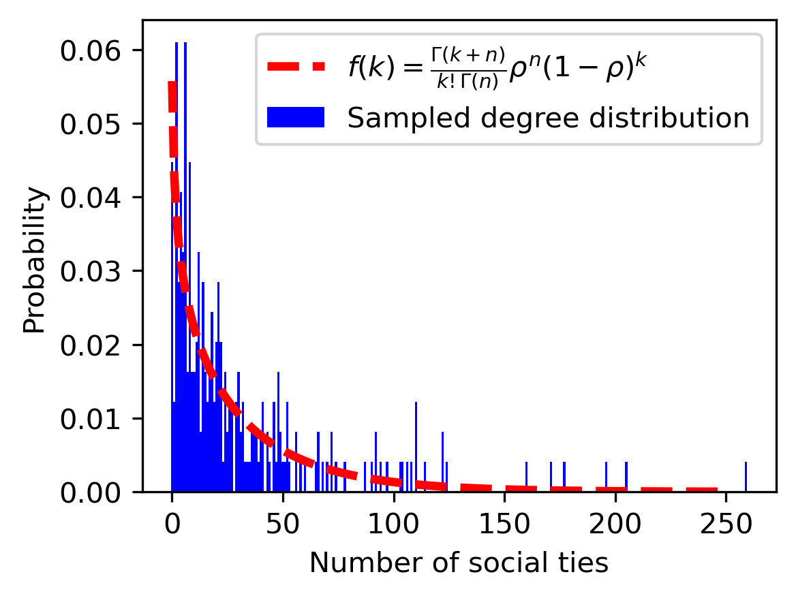
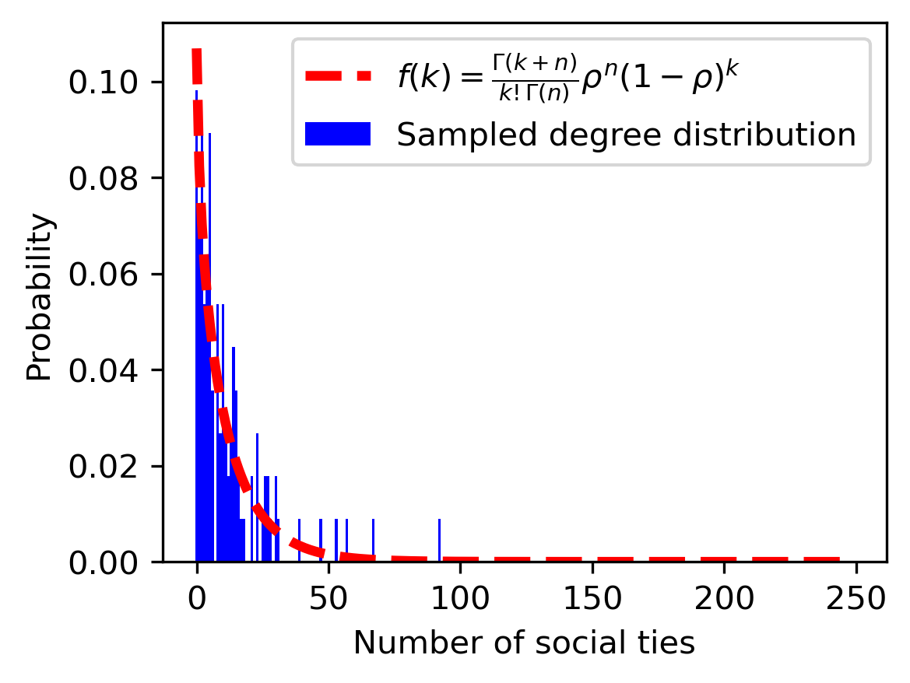
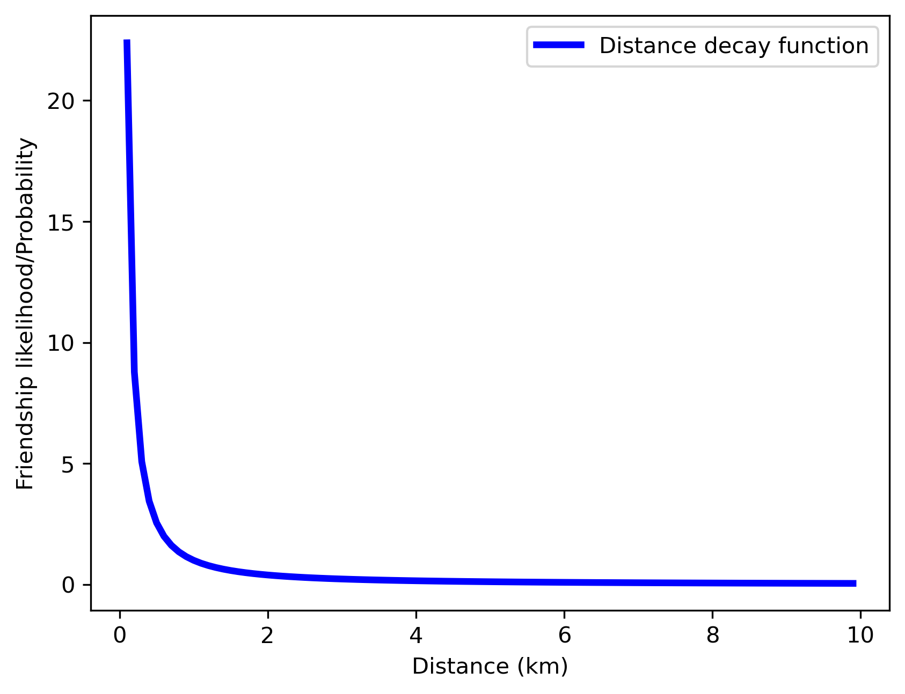
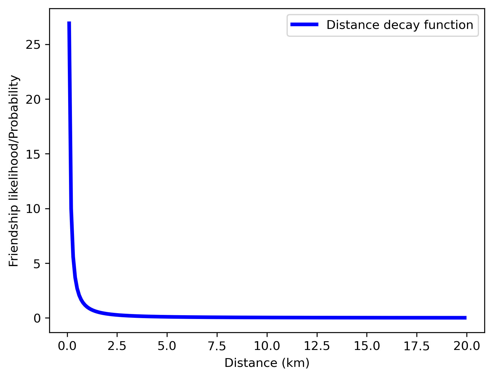
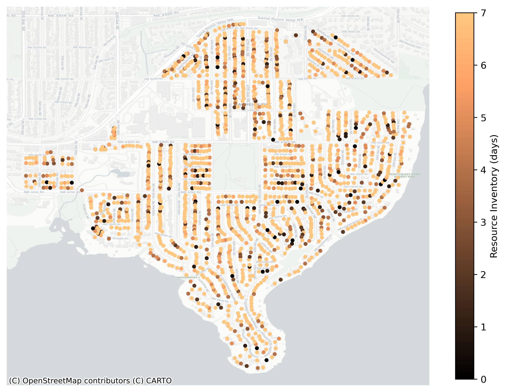
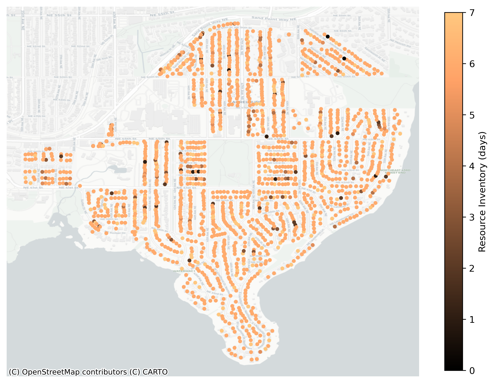
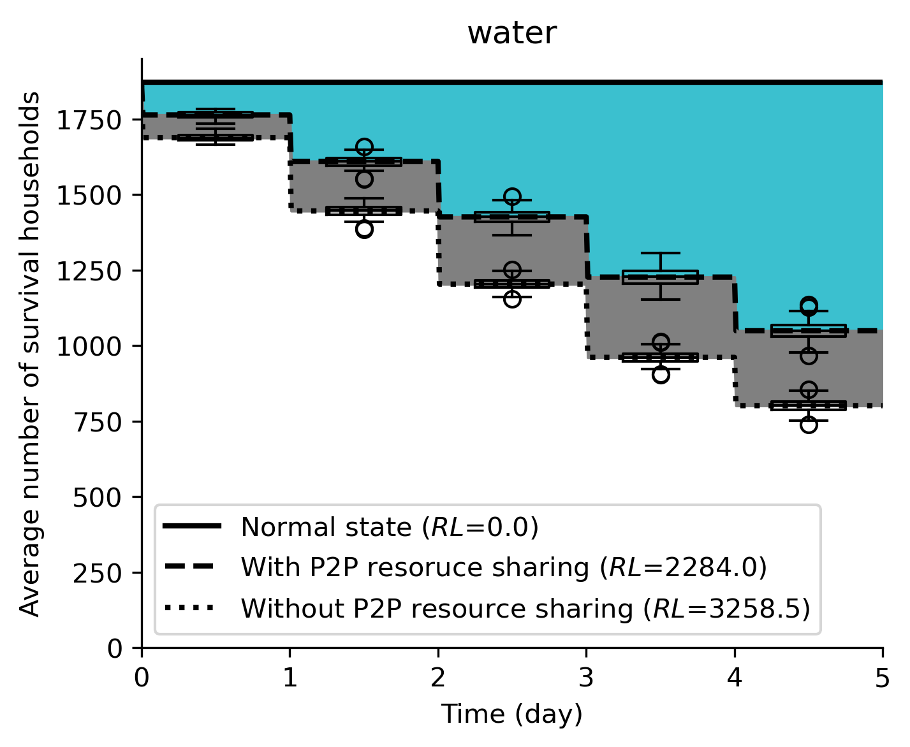

# Peer-to-peer resource sharing

Code for paper "Untapped Capacity of Place-based Peer-to-Peer (P2P) Resource Sharing for Community Resilience" by Zhengyang Li, Katherine Idziorek, Anthony Chen, Cynthia Chen.
 
## Requirements
- Python 3.x.
- Common libraries such as numpy, pandas, matplotlib, scipy, etc.
- Gurobi 10.0.2 (for optimization)
- Networkx 3.1 (for network analysis)

## Installation guide
Clone this repo. How to do this? Check this [link.](https://docs.github.com/en/repositories/creating-and-managing-repositories/cloning-a-repository)

## File organization
- `data`: The derived data used in this project.
- `src`: The source code of this project.
    - `community.py`: The code for generating community-based social networks and P2P resource-sharing networks.
    - `resource_sharing_model.py`: The P2P resource-shairng model.
    - `evaluation_metrics.py`: The evaluation metrics for resilience loss.
- `demo`: The demo code and expected output.
    - `demo.ipynb`: The demo code shows how to use the source code to conduct analysis.
    - `q_vec`: The resoruce inventory of households before P2P resource sharing.
    - `v_vec`: The resource demand of households after P2P resource sharing.
- `results`: The scenario analysis results.
- `figs`: The figures generated in this project.

## Demo
See the `Demo` folder for the demo code and the expected output.

## Framework
The framework of this the place-based P2P resource sharing is shown as below. For more details, please refer to the paper.

### 1. Place-based social network construction

This module requires the following data:
- Degree distribution.
- Distance decay function.
- Household-to-household distance.
- The proportion of strong and weak ties in the community.

Degree distribution.
- Laurelhurst.

- South Park

Distance decay function. 
- Laurelhurst.

- South Park.

Household-to-household distance.
- data/laurelhurst_distance_matrix.npy
- data/southpark_distance_matrix.npy

The proportion of strong and weak ties in the community.
- Laurelhurst: strong ties 0.41296, weak ties 0.58704.
- South Park: strong ties 0.298, weak ties 0.702.

Using the proposed procedure, an example of the generated social network is shown as below.
- Laurelhurst.

- South Park.

### 2. Place-based resource-sharing network construction

This module requires the following data:
- Resource distribution. See [data/laurelhurst_resource_distr_PMF.csv](data/laurelhurst_resource_distr_PMF.csv) and [data/southpark_resource_distr_PMF.csv](data/southpark_resource_distr_PMF.csv).
- Sharing preferece. See [data/laurelhurst_share_pref_PMF.csv](data/laurelhurst_share_pref_PMF.csv) and [data/southpark_share_pref_PMF.csv](data/southpark_share_pref_PMF.csv).
- Sharing priority. 

For strong ties, the sharing priority is 3; for weak ties, the sharing priority is 2; for strangers, the sharing priority is 1.

### 3. P2P Resource-sharing Model

This module redistribute the surplus resources to the needy households based on the sharing preference and sharing priority. Here blow is an example of the resource-sharing model.

- Resource sharing model. [resource_sharing_model.py](src/resource_sharing_model.py)

- Before sharing.

- After sharing.

### 4. Resilience loss analysis
See [evaluation_metrics.py](src/evaluation_metrics.py). This module calculates the resilience loss of the community after the disaster. Here is an example of the evaluation metrics.

## Citation

If you find this code useful in your research, please consider citing:

"Untapped Capacity of Place-based Peer-to-Peer (P2P) Resource Sharing for Community Resilience" by Zhengyang Li, Katherine Idziorek, Anthony Chen, Cynthia Chen.
